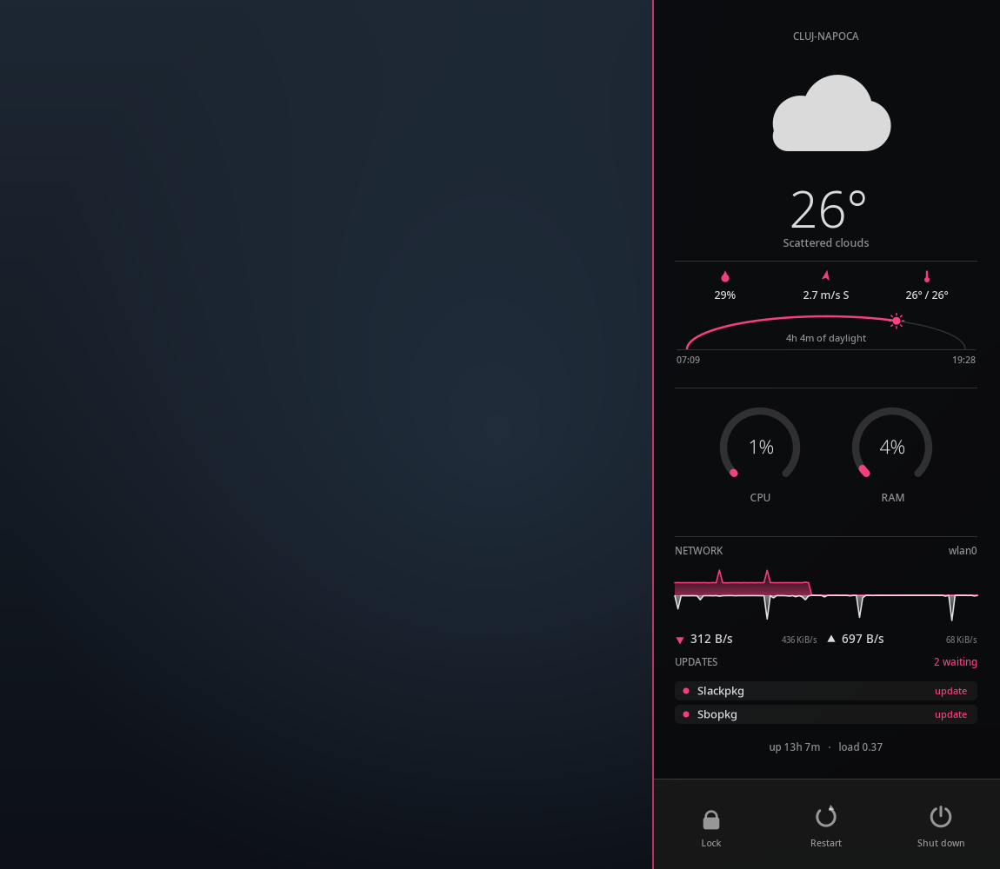

# Conky dashboard for Slackware

A hover-revealed system panel. Push the pointer into the right edge of the
screen and it fades in; move away and it fades out.

It is built to sit **alongside** Conky-Calendar-Extra's modernized widget, not
on top of it: the clock, date, `/` and `/home` usage and CPU core temperatures
all live on that widget, so this panel deliberately does not repeat them. What
it adds is weather, CPU/RAM utilisation, network rates, battery, pending
updates and a power bar.



**Launch conky and you are done.** The panel sizes itself to the screen and
runs its own data collection on a timer — there is no cron entry to install and
nothing else to start.

Everything on the panel is drawn with Cairo — the clock, the ring gauges, the
weather icons and the power buttons are all vectors, so there is no icon font
to install. `conky.text` is empty on purpose.

## Requirements

Only one thing is actually required:

* **conky ≥ 1.24**, built with Lua, Cairo and mouse events. Check with
  `conky --version`.

Text falls back through fontconfig, so any installed font will do; the default
is Noto Sans, changed via `font` in `lua/dashboard.lua`.

Everything else is optional and degrades on its own — a missing tool disables
its widget rather than breaking the panel:

| If you have | You get |
| --- | --- |
| `loginctl` | Working power buttons. Without it they are drawn greyed out and marked unavailable |
| `slackpkg` | The updates list. Without it the rows read `Unknown` |
| `sbopkg`, `w3m`, `nvidia-smi` | The matching update checks; each is opt-in |
| `curl`/`wget` | Update checks that need the network |
| `python3` + an [OpenWeatherMap](https://openweathermap.org/api) key | Weather. Without a key the weather section is hidden entirely |

Not needed, and no longer used: **cron**, **xdotool**, **xdpyinfo**,
**Font Awesome Pro**, **pyowm**, **i3lock**.

## Running

The panel runs from wherever you cloned it — `lua_load` resolves relative to
the config file and the Lua finds its own state files, so nothing has to be
copied into place:

    git clone https://github.com/alexsson-xexpanderx/conky-dashboard
    cd conky-dashboard
    conky -c configs/dashboard.conf &

`./start_conky.sh` does the same thing but kills a previous instance first,
which makes it safe to put in an autostart entry.

### Starting at login

Drop a desktop entry in `~/.config/autostart/`:

```ini
[Desktop Entry]
Type=Application
Name=Conky Dashboard
Exec=/path/to/conky-dashboard/start_conky.sh --delay 10
Terminal=false
```

The delay matters and conky's own `--pause` will not do instead:
`configs/dashboard.conf` reads `_NET_WORKAREA` while it is being parsed, so it
has to run after the desktop has published its panel struts — and conky
applies `--pause` *after* loading the config. Without the wait the panel can
size itself to the whole screen and end up under your panel.

The panel sizes itself to the desktop's *usable* area, so it stops above a
Plasma panel or dock rather than running underneath one. It reads
`_NET_WORKAREA` if `xprop` is available and falls back to the kernel's display
mode list in `/sys/class/drm`. Override any of it:

    CONKY_DASHBOARD_WIDTH=460 CONKY_DASHBOARD_HEIGHT=1440 conky -c configs/dashboard.conf &

`bottom_gap` in `lua/dashboard.lua` (default 18px) is how much clear space to
leave below the button bar. Raise it if your panel floats with a margin, or
set it to `0` to go right to the edge.

## Configuration

Everything lives in the `config` table at the top of `lua/dashboard.lua`.

**Weather** — set the city in `lua/dashboard.lua`, but keep the key out of it:

```lua
owm_city  = "Cluj-Napoca",
owm_ccode = "RO",
```

`lua/dashboard.lua` is tracked by git, so a key written there is one `git push`
from being public. Put it in `.owm_key` at the repository root instead, which
is gitignored:

    printf '%s\n' 'YOUR_KEY_HERE' > .owm_key
    chmod 600 .owm_key

The panel reads that file when `owm_api_key` is empty. With no key at all, the
weather section and the fetch behind it are skipped entirely.

With a key set, the panel shows the condition and icon, temperature and what
it feels like, the day's low and high, humidity, wind speed with its compass
bearing, and a daylight arc tracing the sun from sunrise to sunset with the
current position marked and the remaining daylight spelled out. Sunrise and
sunset are rendered in the *observed city's* local time, not the machine's, so
it stays correct for a place in another timezone.

Until a key is set, `.weather.txt` holds placeholder readings so the section
has something to draw.

**Update checks** — each enabled check is a network round trip, so turn on only
what applies to your machine:

```lua
slackware_release = "current",
update_checks = {
    sbopkg = true,  kernel = false, nvidia = false,
    google_chrome = false, skype = false,
},
```

**Refresh intervals** in seconds. Set either to `0` to switch that collector
off and write the file yourself:

```lua
refresh_updates = 900,
refresh_weather = 900,
```

**Reveal behaviour:**

| `reveal` | Behaviour |
| --- | --- |
| `auto` (default) | Visible until conky delivers its first mouse event, then behaves as `hover`. If pointer input never arrives the panel stays up, rather than being invisible and unreachable |
| `hover` | Only visible while the pointer is on the panel |
| `always` | Never hides |

`confirm_power = true` (the default) makes Shut down and Restart need two
clicks — the first arms the button, the second acts. Lock is single-click.

**Colours** match the modernized Conky-Calendar-Extra theme — white `#FFFFFF`,
pink accent `#FF4081`, warm `#FF7043` — so the two conkys sit together on one
desktop. Gauges and temperatures stay pink until `warm_above_pct` (75%) or
`warm_above_temp` (70 °C) and only then ramp towards the warm colour:

```lua
base   = "#FFFFFF",
accent = "#FF4081",
warm   = "#FF7043",
```

Also tunable: the four opacity tiers, fonts, which filesystem the disk gauge
watches, and the commands the power buttons run.

## How the data gets there

Two state files at the repository root hold everything too slow to collect
while drawing a frame. The panel spawns the collectors in the background on
the intervals above and only ever *reads* the files, so a slow network check
never stalls the display.

Both collectors can also be run by hand, and both write via a temporary file
and a rename, so the panel never sees a half-written file and a failed run
leaves the previous reading in place:

    ./slackware_updates.bash -r current --sbopkg -o .updates.txt
    OWM_API_KEY=... ./openweather.py --city Stockholm --ccode SE --output .weather.txt

The **network** block plots the last 96 seconds of throughput as a mirrored
area graph — download above the axis, upload below — with each half scaled to
its own peak so an asymmetric link still shows both. The figures under the
plot are the current rate and that half's full scale.

`slackware_updates.bash` prints one `Name: Status` line per check, and the
panel keys off the wording:

| Status | Shown as |
| --- | --- |
| `Updates available` | red dot, `update`, counted in the header |
| `No updates available` | green dot |
| `Unknown` | amber dot, `?` — the check could not run |

Adding a checker to the shell script needs no change to the Lua: rows are
parsed generically and the panel reflows to fit them.

### Clicking an update row

A row can run something. `config.update_actions` in `lua/dashboard.lua` maps a
row name to an action; rows with no entry are inert and show no hover state:

```lua
update_actions = {
    Slackpkg = { cmd = "/home/alexsson/Programs/slackpkg/slackpkg-gui" },
    Sbopkg   = { script = "sbopkg_update.sh", terminal = true },
},
```

`cmd` runs a program directly. `script` is a path relative to this repository.
`terminal = true` opens it in a terminal instead — the first of konsole,
xfce4-terminal, alacritty, xterm or urxvt that is installed, or set `terminal`
explicitly.

`sbopkg_update.sh` is the shipped example: it opens a terminal, prints the two
commands sbopkg needs (`su`, then `/usr/sbin/sbopkg -r`) and leaves you at a
shell with both already in the history. It does not try to elevate on your
behalf — sbopkg is interactive and wants a real terminal.

Unlike the power bar, update rows are single-click: none of them destroys
anything.

## Development

Render a frame straight to a PNG, with no X server and no conky. Much faster
than restarting the desktop to check a layout change:

    lua -e 'package.cpath="/usr/lib64/conky/lib?.so;"..package.cpath
            function conky_parse() return "63" end
            dofile("lua/dashboard.lua")
            conky_dashboard_render("/tmp/panel.png", 400, 1048)'

A fifth argument previews states that otherwise need a real pointer, e.g.
`{ pointer = { x = 340, y = 1000 }, armed = "poweroff" }`.

Syntax-check everything:

    luac -p lua/dashboard.lua && bash -n slackware_updates.bash \
      && python3 -m py_compile openweather.py
