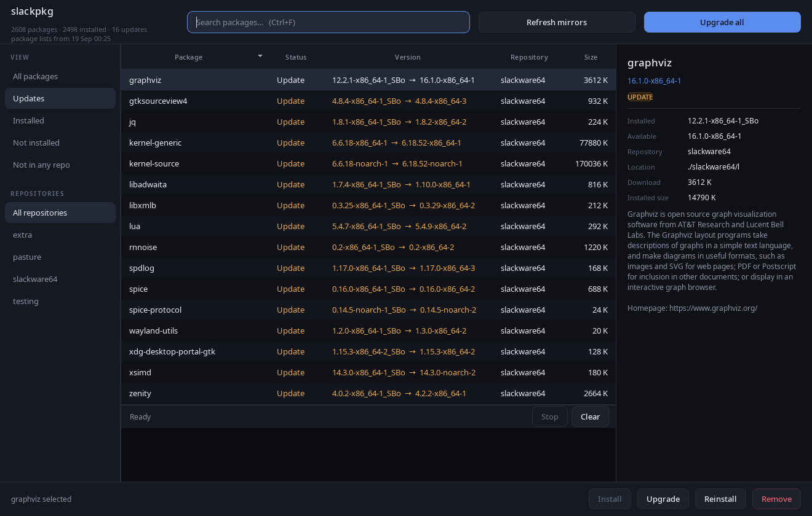

# slackpkg-gui

A desktop front end for [slackpkg](https://slackpkg.org/), Slackware's package
manager. Python 3 + PyQt6.



## Running

```
./slackpkg-gui
```

Run it as your normal user. The package list is built from files anyone can
read, so the window opens without asking for anything. Root is requested
per action, through `pkexec`, only when something is actually installed,
upgraded or removed.

Requires `python3`, `PyQt6`, a working `slackpkg`, and `pkexec` (or `sudo`).

## What it does

* Browses every package in the merged `PACKAGES.TXT`, including extra repos
  added by slackpkg+, alongside everything pkgtools has recorded as installed.
* Filters by view (updates, installed, not installed, packages no configured
  mirror offers) and by repository, with live search over names and summaries.
* Install, reinstall, upgrade and remove, on one package or a multi-selection.
* Refresh mirrors (`slackpkg update`), Install new (`slackpkg install-new`) and
  Upgrade all (`slackpkg upgrade-all`), each labelled with its own count and
  lit only when it has something to do.
* Honours `/etc/slackpkg/blacklist`: a blacklisted package shows as **Held**
  rather than as an available update, because slackpkg would skip it.
* Sizes an operation against free disk space before starting it.
* Streams slackpkg's own output into a console pane as it runs, and lets you
  answer its prompts there.

## How it treats your system

It does not reimplement any part of package management — every action shells
out to the real `slackpkg`, so the behaviour is whatever your slackpkg and its
`functions.d` extensions already do.

slackpkg is an interactive script, and it is run as one: it gets a real pty,
its prompts appear in the log, and you answer them in the box underneath. That
includes the one that decides whether new `/etc` config files replace yours —
a question no front end should be answering on your behalf.

Every action still shows the exact command line first, and on a removal, when
the packages will not fit on disk, or when new packages ought to be installed
before upgrading, Enter defaults to Cancel.

Nothing here writes to your system directly. The only thing that changes
anything is `pkexec slackpkg`, behind that dialog.

"Update" in the package list means the installed build differs from the one
the mirror offers — the same comparison slackpkg makes. It does not attempt to
decide which is newer, so a downgrade looks the same.

## Layout

| file | role |
| --- | --- |
| `slackpkg_gui/backend.py` | parses `PACKAGES.TXT` and `/var/log/packages`; no privileges, no network |
| `slackpkg_gui/runner.py` | builds the argv, escalates, streams output |
| `slackpkg_gui/theme.py` | the palette and stylesheet |
| `slackpkg_gui/app.py` | model, filtering, window |
| `slackpkg_gui/console.py` | turns slackpkg's terminal control codes into text |

`./slackpkg-gui --screenshot out.png` renders the window and exits, which works
under `QT_QPA_PLATFORM=offscreen` for checking the layout without a display.
